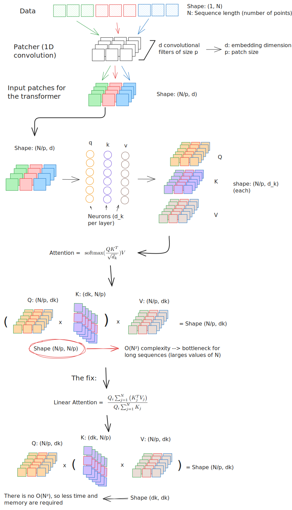
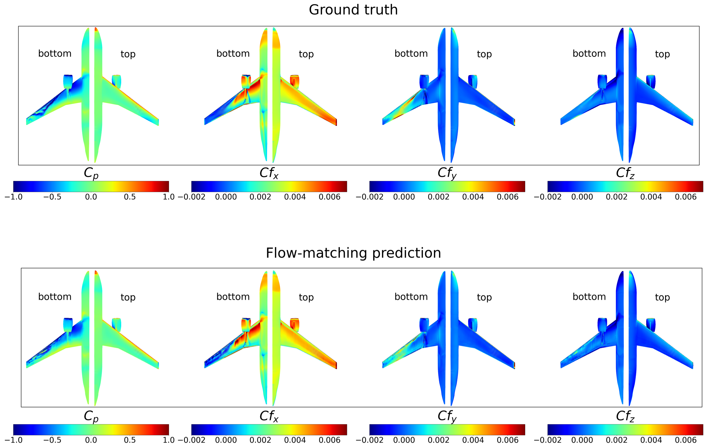

# *FluidFlow*: a flow-matching generative model for fluid dynamics surrogates on unstructured meshes

**David Ramos¹, Lucas Lacasa², Fermín Gutiérrez¹, Eusebio Valero¹·³, Gonzalo Rubio¹·³**

¹ ETSIAE-UPM · School of Aeronautics, Universidad Politécnica de Madrid  
² Institute for Cross-Disciplinary Physics and Complex Systems (IFISC, CSIC-UIB)  
³ Center for Computational Simulation, Universidad Politécnica de Madrid  

[](https://github.com/DavidRamosArchilla/FluidFlow)
[](https://github.com/DavidRamosArchilla/FluidFlow)
[](https://DavidRamosArchilla.github.io/FluidFlow)

---

<video src="https://github.com/user-attachments/assets/6730b733-7352-4ac2-8f4b-aa0821bf3394" width="100%" controls autoplay loop></video>

## Usage

Look at `scripts/` to see more examples.

```python
from data.generate_synthetic_data import AnalyticalFunctionDataset
from fluidFlow.dit import DiT
from fluidFlow.trainer import Trainer
from fluidFlow.flow_matching import create_flow_matching

import numpy as np
import torch
from torch.utils.data import TensorDataset

# 1. generate synthetic dataset / load you own dataset here
data_resolution = (32, 32)
generator = AnalyticalFunctionDataset(nx=data_resolution[0], ny=data_resolution[1], x_range=(0, 2*np.pi), y_range=(0, 2*np.pi))
solutions_random, parameters_random = generator.generate_dataset(
    n_samples=1000,
    alpha1_range=(-2.0, 2.0),
    alpha2_range=(-2.0, 2.0)
)
# add channel dimension to solutions
solutions_random = solutions_random[:, None, :, :]
n_train = int(0.8 * len(solutions_random))
train_data = TensorDataset(torch.from_numpy(solutions_random[:n_train]).float(), torch.from_numpy(parameters_random[:n_train]).float())
test_data = TensorDataset(torch.from_numpy(solutions_random[n_train:]).float(), torch.from_numpy(parameters_random[n_train:]).float())

# 2. Define the DiT model and the flow-matching training procedure
model = DiT(
    depth=6,
    hidden_size=128,
    patch_size=1,
    num_heads=4,
    input_size=data_resolution, # dataset grid size
    cond_dim=2, # number of parameters (alpha1, alpha2)
    class_dropout_prob=0.2,
    in_channels=1,
    learn_sigma=False,
    use_swiglu=True,
    use_rope=True,
    # qk_norm=True, # when bf16 training
    attn_type="vanilla",  # window, linear, vanilla
    mlp_ratio=2.5,
)

flow_matching = create_flow_matching(
    neural_net=model,
    input_size=data_resolution,
    cond_scale=2.0,
    sampling_method="euler",
    num_sampling_steps=400,
)

# 3. Define trainer and training configuration
results_folder = './results'
train_steps = 100000
trainer = Trainer(
    flow_matching,
    dataset=train_data,
    dataset_test=test_data,
    train_batch_size=64,
    train_lr=2e-4,
    train_num_steps=train_steps,  # total training steps
    gradient_accumulate_every=1,  # gradient accumulation steps
    ema_decay=0.995,  # exponential moving average decay
    # amp=True,     # turn on mixed precision for faster training and reduced memory usage
    # mixed_precision_type='bf16',
    results_folder=results_folder,  # folder to save results to
    save_and_sample_every=20000,
    eta_min_scheduler=1e-6,
    max_grad_norm=1.0,
    use_cpu=True, # JUST FOR TESTING, SET TO FALSE FOR ACTUAL TRAINING
    compile_model=True,
    split_batches=True
)

# 4. Train the model
trainer.train()
```
Samples and model checkpoints will be logged to `./results` periodically

### Multi-GPU Training

The `Trainer` class is now equipped with <a href="https://huggingface.co/docs/accelerate/en/package_reference/accelerator">🤗 Accelerator</a>. You can easily do multi-gpu training in two steps using their `accelerate` CLI

At the project root directory, run

```python
$ accelerate config
```

Then, in the same directory

```python
$ accelerate launch train.py
```

### Flash Attention 4

The DiT architecture can be trained with Flash Attention 4 for improved speed and memory efficiency. To enable it, you need to <a href="https://github.com/Dao-AILab/flash-attention">install</a> it and FluidFlow will autmatically use it if available. As an important note, Flash Attention 4 doesn't with with values of `head_dim` smaller than 128.


## Abstract

Computational fluid dynamics (CFD) provides high-fidelity simulations of fluid flows but remains computationally expensive for many-query applications. In recent years deep supervised learning (DL) has been used to construct data-driven fluid-dynamic surrogate models. In this work we consider a different learning paradigm and embrace generative modelling as a framework for constructing scalable fluid-dynamics surrogate models.

We introduce *FluidFlow*, a generative model based on conditional flow-matching — a recent alternative to diffusion models that learns deterministic transport maps between noise and data distributions. *FluidFlow* is specifically designed to operate directly on CFD data defined on both structured and unstructured meshes alike, without the need to perform any mesh interpolation pre-processing and preserving geometric fidelity.

We assess the capabilities of *FluidFlow* using two different core neural network architectures — a U-Net and a Diffusion Transformer (DiT) — and condition their learning on physically meaningful parameters such as Mach number, angle of attack, or stagnation pressure (a proxy for Reynolds number). The methodology is validated on two benchmark problems of increasing complexity: prediction of pressure coefficients along an airfoil boundary across different operating conditions, and prediction of pressure and friction coefficients over a full three-dimensional aircraft geometry discretized on a large unstructured mesh.

In both cases, *FluidFlow* outperforms strong multilayer perceptron baselines, achieving significantly lower error metrics and improved generalisation across operating conditions. Notably, the transformer-based architecture enables scalable learning on large unstructured datasets while maintaining high predictive accuracy. These results demonstrate that flow-matching generative models provide an effective and flexible framework for surrogate modelling in fluid dynamics, with potential for realistic engineering and scientific applications.

---

## Method

We trained FluidFlow with 2 different CFD datasets: airfoil Cp distribution and aircraft Cp and Cf distributions. The airfoil case is simpler, since it can be considered as 1D structured data. Here, we tested two neural network architectures: U-Net and DiT. Both models perform similarly and can work with this kind of data without significant modification.

However, some problems arise when we switch to 3D. Here, the data comes from unstructured meshes and spatial information is more difficult to capture. This makes the U-Net unsuitable for this task, since it relies on convolutional layers. To address this issue, we treated the data as a sequence of points. With this approach, the DiT could be used with only minor modifications to the patching block to accommodate this sequential data. However, the DiT presents its own challenges since it relies on the attention mechanism, which scales quadratically with the number of points — too expensive given that each aircraft has more than 260,000 points.

We propose replacing self-attention with linear attention, a different approach that does not scale quadratically and incurs only a slight loss in accuracy. The diagram below illustrates how the patching and attention components of the blocks are modified.


*Figure 1. Overview of the FluidFlow DiT modifications: 1D patcher and linear attention replacement.*

---

## 3D Aircraft Results

FluidFlow faithfully reconstructs high-fidelity pressure and velocity fields across a wide range of Reynolds numbers and geometries directly on the native unstructured mesh, without any remeshing step.


*Comparison between (ground truth) CFD pressure/friction coefficient fields (top panels) and the prediction generated by the DiT flow-matching model (bottom panels) for one particular operating condition with parameters π = 1×10⁵, M = 0.3 and AoA = −6.*

We evaluate FluidFlow on the [ONERA 468 CRM challenge](https://www.codabench.org/competitions/7535/), a public benchmark for aerodynamic surrogate modeling on the Common Research Model geometry. The task consists of predicting the pressure coefficient Cp and the friction coefficients Cf,x, Cf,y, Cf,z over the aircraft surface across varying flight conditions, using the official train/test split provided by the challenge. We compare against the baseline MLP model supplied by the organizers — FluidFlow (DiT) outperforms it on every metric.

| Model | R² | R²\_Cp | R²\_Cf,x | R²\_Cf,y | R²\_Cf,z |
|---|---|---|---|---|---|
| MLP | 0.956 | 0.972 | 0.944 | 0.951 | 0.957 |
| *FluidFlow* (DiT) | **0.965** | **0.974** | **0.959** | **0.960** | **0.965** |

---

To reproduce this results, download the <a href="https://entrepot.recherche.data.gouv.fr/file.xhtml?persistentId=doi:10.57745/Z9LDY8&version=2.0">data</a> and run the `scripts/train_onera_crm.py` script. 

## Airfoil Results

FluidFlow outperforms a standard multilayer perceptron (MLP). The following animations demonstrate how FluidFlow carries out the denoising process for the airfoil Cp case — starting from Gaussian noise and travelling to the data distribution for unseen test cases.

<table style="width: 100%; text-align: center;">
  <tr>
    <td><video src="https://github.com/user-attachments/assets/d9a5cbf6-d8f1-4ac0-91fe-04e04170209d" width="100%" controls autoplay loop muted></video></td>
    <td><video src="https://github.com/user-attachments/assets/afd95730-588a-45ec-8e29-26448bdab3fd" width="100%" controls autoplay loop muted></video></td>
    <td><video src="https://github.com/user-attachments/assets/1a04454a-cfc2-4fab-9911-40b4ac678de8" width="100%" controls autoplay loop muted></video></td>
  </tr>
  <tr>
    <td>Airfoil simulation 1</td>
    <td>Airfoil simulation 2</td>
    <td>Airfoil simulation 3</td>
  </tr>
  <tr>
    <td><video src="https://github.com/user-attachments/assets/2bf0a392-c552-4938-8096-1adfae8f41f6" width="100%" controls autoplay loop muted></video></td>
    <td><video src="https://github.com/user-attachments/assets/6d67513d-946a-47fa-8e15-cbcdb52eda03" width="100%" controls autoplay loop muted></video></td>
    <td></td>
  </tr>
  <tr>
    <td>Airfoil simulation 4</td>
    <td>Airfoil simulation 5</td>
    <td></td>
  </tr>
</table>

> **Note:** If the animations take to long to load, please visit the [project page](https://DavidRamosArchilla.github.io/FluidFlow) to watch them.

In the following table we compare the metrics extracted for the test set of a well-optimized MLP (tuned via Optuna) with the two versions of FluidFlow (U-Net and DiT):

| Model | MSE | RMSE | MAE | MRE (%) | AE₉₅ | AE₉₉ | R² | Relative L² |
|---|---|---|---|---|---|---|---|---|
| Vanilla MLP | 0.00129 | 0.03598 | 0.01763 | 16.85219 | 0.05716 | 0.14176 | 0.99730 | 0.04911 |
| *FluidFlow* (U-Net) | **0.00009** | 0.00961 | **0.00240** | 4.48810 | **0.00761** | **0.03175** | **0.99981** | 0.01325 |
| *FluidFlow* (DiT) | **0.00009** | **0.00953** | 0.00249 | **3.43723** | 0.00764 | 0.03246 | **0.99981** | **0.01314** |

---

## BibTeX

If you find this work useful, please consider citing:

```bibtex
@article{ramos2025fluidflow,
  title     = {FluidFlow: a flow-matching generative model for
               fluid dynamics surrogates on unstructured meshes},
  author    = {Ramos, David and Lacasa, Lucas and
               Guti{\'e}rrez, Ferm{\'i}n and
               Valero, Eusebio and Rubio, Gonzalo},
  journal   = {arXiv preprint arXiv:2501.XXXXX},
  year      = {2025},
}
```

---

© 2026 FluidFlow Authors · [Project Page](https://DavidRamosArchilla.github.io/FluidFlow) · [NuMath Lab](https://numath.dmae.upm.es/)